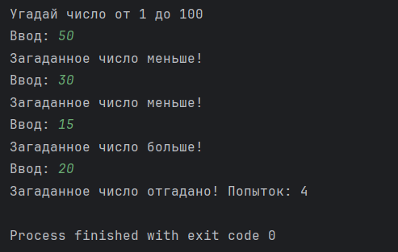

# Угадай число (Java)
Простой консольный проект на Java, в котором пользователь пытается угадать случайное число, загаданное программой. Программа подсказывает, больше или меньше введённое число, и считает количество попыток.

**Навыки:** Random, циклы, ввод с клавиатуры (Scanner).  
**Идеи:**
- Пользователь вводит число с клавиатуры
- Подсказки: «меньше», «больше»
- Счётчик количества попыток

# Пример работы программы

Вот пример вывода в терминале:

